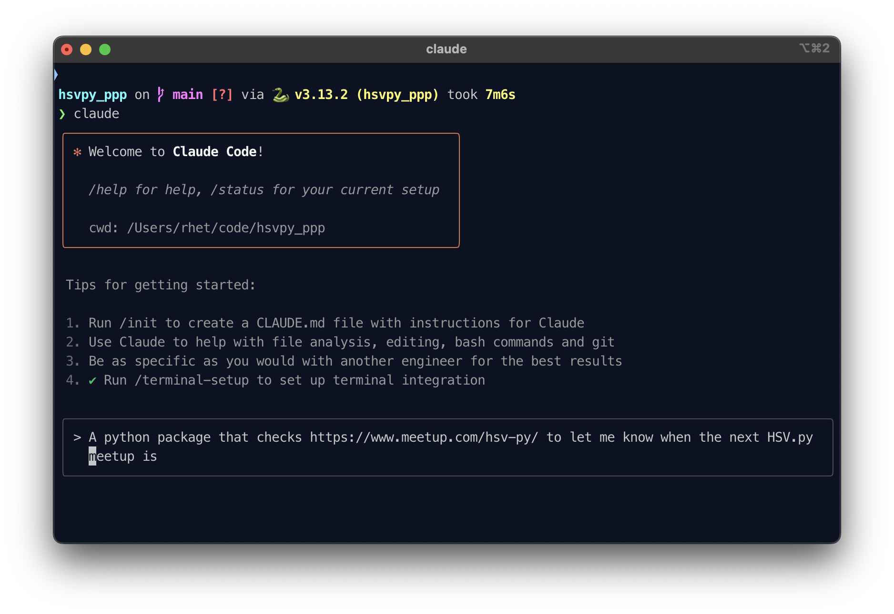
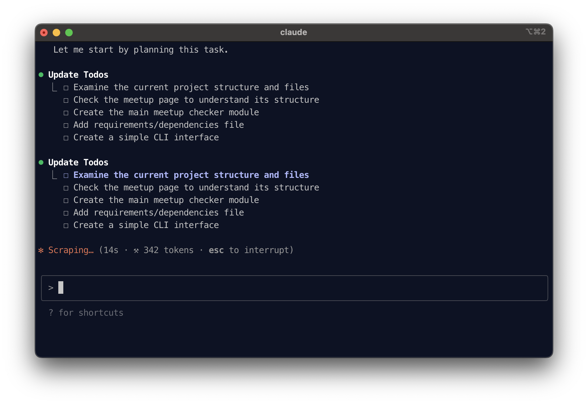
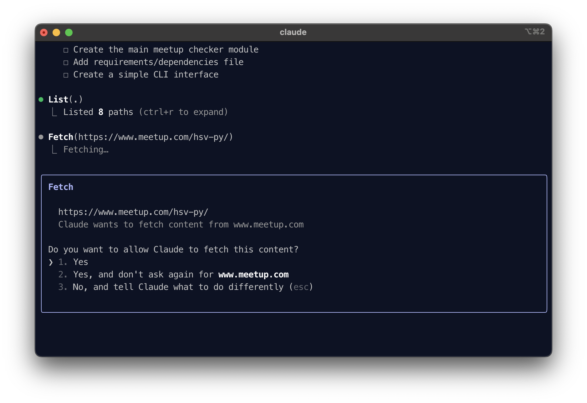
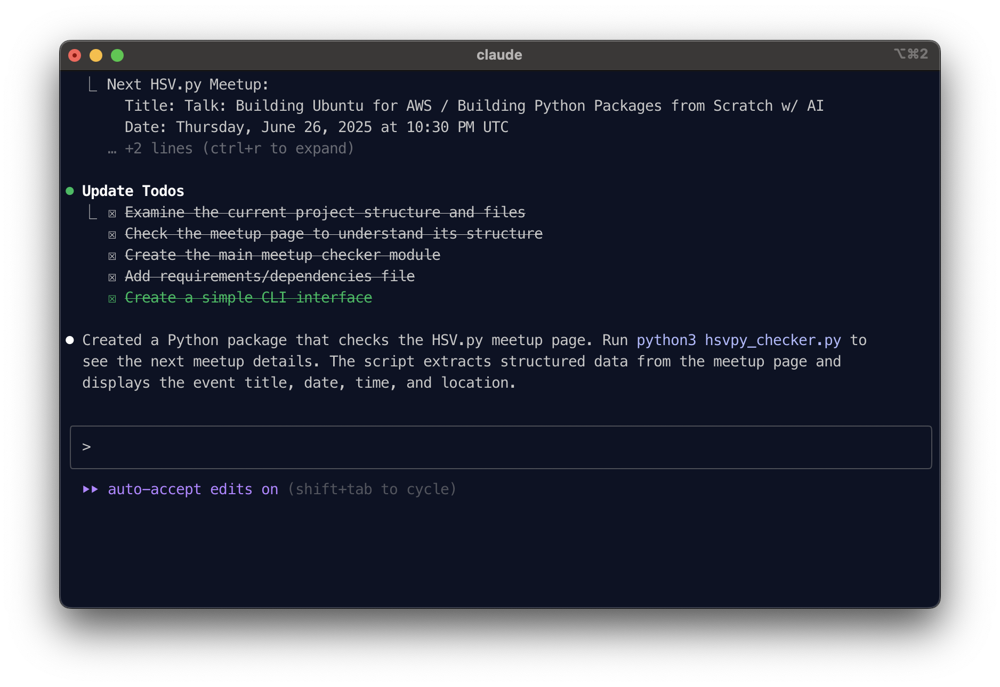
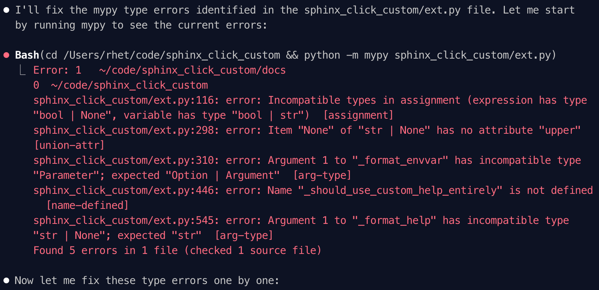
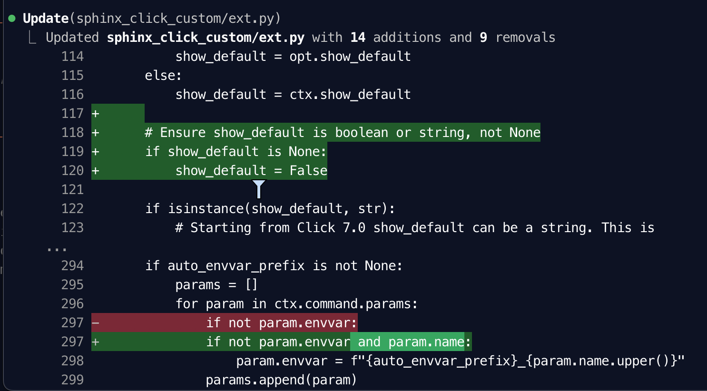
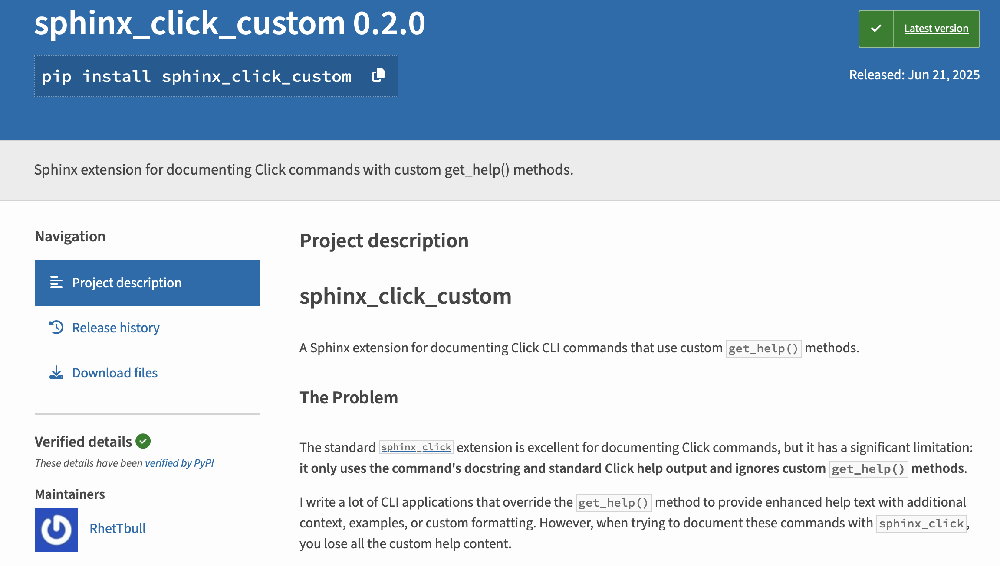
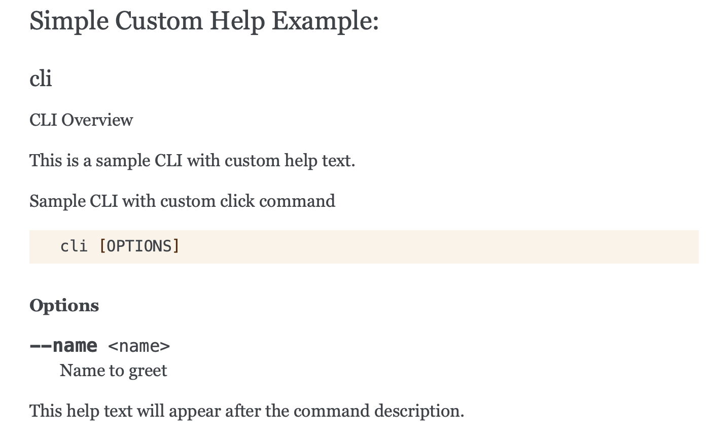

autoscale: true

# Prompt, Package, Publish!

<br>
<br>
<br>
<br>
<br>

Using AI agents to create & publish a python package from scratch

Rhet Turnbull
HSV.py, 26 June 2025


---

## About Me


- Hobbyist programmer
- First code in Tandy BASIC on a TRS-80 Model III
- Reformed Perl hacker
- Pythonista since 2018
- [github.com/RhetTbull](https://github.com/RhetTbull)

---

## The Problem I was Trying to Solve

- Maintain documentation for my [osxphotos](https://github.com/RhetTbull/osxphotos) project with [Sphinx](https://www.sphinx-doc.org/en/master/) and [sphinx-click](https://github.com/click-contrib/sphinx-click)
- I use custom help methods for my [click](https://click.palletsprojects.com/en/8.1.x/) documentation
- sphinx-click doesn't support custom help methods

But who wants to write a plugin for Sphinx?

---

## Let AI Write The Code!

Lots of AI tools! Here's a sample of some of the tools I've tried:

- [Github Copilot](https://github.com/copilot): plug-in for your editor (VSCode, Neovim, etc.)
- [Lovable](https://lovable.dev/): create apps & websites
- [Cursor](https://www.cursor.com): AI powered editor
- [Claude Code](https://www.anthropic.com/claude-code), [Codex](https://openai.com/codex/): AI powered agents in your terminal!

---

## Claude Code

```bash
npm install -g @anthropic-ai/claude-code
```

## OpenAI Codex

```bash
npm i -g @openai/codex
```

## Gemini CLI

```bash
npm install -g @google/gemini-cli
```

---



---



---



---



---

## HSV.py Meetup Checker

```bash
❯ python hsvpy_checker.py
Next HSV.py Meetup:
  Title: Talk: Building Ubuntu for AWS / Building Python Packages from Scratch w/ AI
  Date: Thursday, June 26, 2025 at 10:30 PM UTC
  Location: GigaParts, Inc., 6123 University Dr, Huntsville, AL, Huntsville, AL
  URL: https://www.meetup.com/hsv-py/events/308413632/
```

---

## A More Complex Example

This sample python project uses Click to build a simple CLI. It uses sphinx and sphinx\_click to generate documentation. However, the sample CLI uses a custom Click\.Command class that has a custom get\_help() method to customize the help. This works fine when run from the command line (`python3 cli.py --help`) but the sphinx documentation (generated with sphinx\_click) shows only the standard help from the entry point docstring not the custom generated help. Create a sphinx plugin, sphinx\_click\_custom, that correctly generates the documentation from the custom Command class get_help() method. Use flit to package the plugin. Write tests for the plugin using pytest. Use pytest stype methods, not unittest classes. Add a README.md for the project.

---

```text
⏺ I'll help you create a custom Sphinx plugin sphinx_click_custom that generates documentation
  from your custom Command class's get_help() method. Let me start by examining your current
  setup and understanding how sphinx_click works.

⏺ Update Todos
  ⎿  ☐ Examine existing cli.py to understand custom Command class implementation
     ☐ Research sphinx_click source code to understand how it extracts help text
     ☐ Create sphinx_click_custom plugin that uses get_help() method
     ☐ Check current Sphinx documentation setup in docs/
     ☐ Update Sphinx configuration to use new plugin
     ☐ Test documentation generation with custom plugin
```

*Note*: I also used claude to generate the example `cli.py` that used a custom `get_help()` function to get this started.

---

## Tips for Prompting the Assistant

- Treat the AI like a junior developer
- Be explicit
- Break complex tasks into smaller steps (CLI agents are getting good at this)
- Use iterative refinement (add tests, documentation, refactor, logging, etc.)

---

## Testing

- [Why You Shouldn't Use AI To Write Your Tests](https://swizec.com/blog/why-you-shouldnt-use-ai-to-write-your-tests/?utm_source=changelog-news)
- Tends to write tests that are implementation specific
- Misses edge cases
- Wants to use unittest even when I specified pytest

---

```text
⏺ Now let me run all the tests to make sure the pytest-style functions work correctly:

⏺ Bash(python -m pytest tests/ -v)
  ⎿  ============================= test session starts ==============================
     platform darwin -- Python 3.13.2, pytest-8.4.0, pluggy-1.6.0 -- /Users/rhet/code/sphinx_click_custom/.venv/bin/python
     cachedir: .pytest_cache
     rootdir: /Users/rhet/code/sphinx_click_custom
     … +56 lines (ctrl+r to expand)

⏺ Perfect! Let me run with coverage to verify we still have good coverage:

⏺ Bash(python -m pytest tests/ --cov=sphinx_click_custom --cov-report=term-missing)
  ⎿  ============================= test session starts ==============================
     platform darwin -- Python 3.13.2, pytest-8.4.0, pluggy-1.6.0
     rootdir: /Users/rhet/code/sphinx_click_custom
     configfile: pytest.ini
     … +19 lines (ctrl+r to expand)
```

---

## "Ensure mypy runs cleanly"

[.column]



[.column]



---

## Task Completed!



[https://github.com/RhetTbull/sphinx\_click\_custom](https://github.com/RhetTbull/sphinx_click_custom)

---



---

```text
> /cost
  ⎿  Total cost:            $15.43
     Total duration (API):  1h 17m 27.5s
     Total duration (wall): 8h 43m 49.4s
     Total code changes:    4175 lines added, 1212 lines removed
     Token usage by model:
         claude-3-5-haiku:  322.1k input, 23.8k output, 0 cache read, 0 cache write
            claude-sonnet:  936 input, 115.1k output, 17.9m cache read, 2.1m cache write
```

---

[.column]

## Worked Well

- Fulfilled the task with just a small amount of intervention
- Working package, documented, and published to pypi
- Basic tests, mypy runs cleanly, basic README
- Solved my problem!

[.column]

## Didn't Work as Well

- Tests are very implmentation specific
- Missed a few edge cases (some unique to my use case)
- Tends to solve edge cases with overly specific implementations
- Can get expensive (I was using metered API)

---

## Tips

- Always start with a clean git repo & new branch
- Customize your setup (`CLAUDE.md`, `AGENT.md`)
- Curate the list of allowed tools
- Install GitHub `gh` CLI (Claude knows how to use it)
- Ask the agent to read specific files (direct it to the problem)
- Ask the agent to make a plan to solve the problem
- YOLO! `claude --dangerously-skip-permissions`

---


## This Talk

[https://github.com/RhetTbull/hsvpyppp](https://github.com/RhetTbull/hsvpyppp)


---
